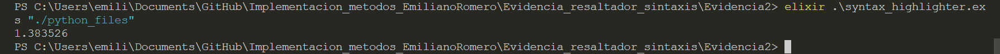
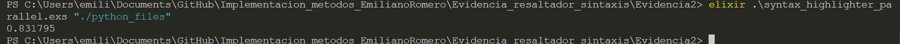

# Evidencia: resaltador de sintaxis de Python en paralelo

### Emiliano Romero López    A01028415

Este es un resaltador de sintaxis para procesar archivos de texto escritos en el lenguaje Python. La versión en el archivo llamado syntax_highlighter_parallel.exs ahora usa múltiples núcleos para procesar varios archivos a la vez, lo que resulta en un tiempo de ejecución más rápido comparado con la versión secuencial del programa. Esta versión secuencial procesa un archivo a la vez.

## Correr el programa
Para correr el programa secuencial, es necesario ingresar en terminal el siguiente comando: elixir .\syntax_highlighter.exs \<path de la carpeta donde se encuantran los archivos de texto>. Para correr el programa en paralelo, es necesario ingresar en terminal el siguiente comando: elixir .\syntax_highlighter_parallel.exs \<path de la carpeta donde se encuantran los archivos de texto>.El programa se encargará de generar un nuevo nombre para los archivo de salida, que será el mismo que el de entrada pero con extensión .html. En la carpeta Evidencia_resaltador_sintaxis se encuentra un archivo css para dar formato y color al archivo HTML resultante. La salida de ambos programas es el tiempo de ejecución. 

## Ejemplos
Se han proporcionado 3 archivos de código de Python llamados py1.txt, py2.txt y py3.txt a manera de ejemplo para ser procesados por el programa. Para fines de una comparación más clara, se ha extendido la longitud de los archivos para que sea más notable la diferencia en tiempo.

## Tabla de expresiones regulares

Algunas de las expresiones no son mostradas adecuadamente en la tabla, consultar el código de markdown o el archivo exs para verlas completas.

| Token    | Regex                                                                                         |
|--------------|------------------------------------------------------------------------------------------------------------------------------------------|
| Whitespace   | ~r/^\s+/                                                                                    |
| Reserved     | ~r/^\b(?:and|as|assert|async|await|break|class|continue|def|del|elif|else|except|False|finally|for|from|global|if|import|in|is|lambda|None|nonlocal|not|or|pass|raise|return|True|try|while|with|yield)\b/ |
| Function     | ~r/^\b\w+(?=\s*\()/                                                                               |
| Magic        | ~r/^\b__\w+__\b/                                                                                    |
| Variable     | ~r/^\b[a-zA-Z_][a-zA-Z0-9_]*\b/                                                                    |
| Operator     | ~r/^[-+*\/%=<>!&|^~]+/                                                                             |
| Number       | ~r/^[-+]?\b\d+\.?\d*\b/                                                                            |
| Comment      | ~r/^#.*?$/                                                                                          |
| Punctuation  | ~r/^[()\[\]{}:;.,\\]/                                                                               |
| String       | ~r/^(\'\'\'[\s\S]*?\'\'\'|"""[\s\S]*?"""|\'[^\n\']*\'|"[^\n"]*")/                                |

## Complejidad del algoritmo

El programa analiza línea por línea al código de texto de entrada. Podemos llamar n al número de líneas que tiene este archivo. Después, cada línea es procesada individualemente al hacer match con cada uno de sus tokens, podemos llamar m al número de tokens promedio por cada línea. Las operaciones que realiza posteriormente depende del número de tokens que haya por línea, por lo que por cada token en una línea, primero se realiza un match y después una operación. Se recorre dos veces la cantidad de tokens en una línea. Por esto, la complejidad del algoritmo es de O(n*2m).

Me parece que esta solución proporciona un tiempo de ejecución razonable dada la naturaleza de los requerimientos. Es necesario procesar cada línea de esta forma para poder extraer la información necesaria.

Agregar el procesamiento en paralelo resulta en un tiempo de ejecución más rápido, solo al analizar varios programas a la vez. 

## Speedup

El tiempo que tarda la versión secuencial del programa después de promediar 5 ejecuciones es: 1.354921 segundos. 

$T_1 = 1.354921$

El número de procesadores utilizados en el programa es de 8.

$p = 8$

El tiempo que tarda en ejecutarse la versión paralela del programa después de promediar 5 ejecuciones es: 0.854056 segundos.

$T_p = 0.854056$

Por lo tanto, utilizando la fórmula $S_p = T_1/T_p$, el speedup al utilizar 8 núcleos es de:

$S_p = 1.5864545182048952$

### Ejemplo de tiempo de ejecución del programa secuencial

### Ejemplo de tiempo de ejecución del programa paralelo

## Reflexión

Como el cáculo del speedup indica, utilizar la versión paralela del programa otorga resultados más rápidos que la versión secuencial de este. La forma paralela distribuye el trabajo entre los procesadores de la computadora, y estos son capaces de manejar eficientemente esta carga mientras que la versión secuencial tiene que procesar los archivos uno tras otro. Esto resulta en una pérdida de eficiencia que se puede evitar, demostrando lo útil que puede ser desarrollar aplicaciones diseñadas para manejar tareas en forma paralela. Este tipo de soluciones representa la forma en que el desarrollo de nuevas tecnologías de cómputo pueden agilizar el procesamiento de información, lo que lleva a resultados más rápidos que generan un mayor valor en el mercado. En conclusión, esta solución brinda grandes beneficios siempre y cuando la implementación sea adecuada.

## Implicaciones éticas

En cuanto a temas de seguridad y privacidad, este programa me ha demostrado la facilidad con la que se puede filtrar y clasificar información una vez que se cuenta con el texto y caracteres puros. Creo que es importante tener en cuenta los requisitos de seguridad necesarios para garantizar que la información sensible o privada no sea accesible sin los permisos necesarios, de otra forma es fácil establecer patrones para encontrar contraseñas, números de teléfono, etc. 

Con temas relacionados a la justicia como en casos criminales, creo que esta tecnología puede ser una herramienta útil para encontrar evidencias y pruebas fácilmente mediante la investigación de documentos.

En general, creo que esta es una herramienta poderosa que debe ser utilizada con responsabilidad, y, siempre y cuando sea de manera ética, puede ser muy útil para tareas diarias. El manejo eficiente de este tipo de información puede ahorrar horas de búsqueda y clasificación, o para nosotros como programadores, facilitar el trabajo de correción y edición de código. 

Además, la implementación de la versión en paralelo del programa otorga soluciones más rapidas y eficientes que son de mayor valor para quienes buscan adquirir estos servicios. De esta forma se ahorran recursos de procesamiento y tiempo que pueden ser cruciales a la hora de manejar aplicaciones que requieren grandes capacidades de procesamiento. 

