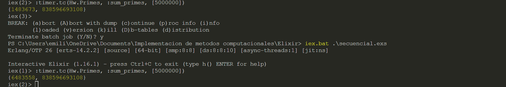

# Activity 5.2

### Emiliano Romero López A01028415

Ambas versiones del programa regresan el resultado esperado, que es 838,596,693,108.

El tiempo que tarda la versión secuencial del programa es: 6483558 microsegundos, o 6.483558 segundos. 

$T_1 = 6.483558$

El número de procesadores utilizados en el programa es de 8.

$p = 8$

El tiempo que tarda en ejecutarse la versión paralela del programa es de 1483673 microsegundos, o 1.483673 segundos.

$T_p = 1.483673$

Por lo tanto, utilizando la fórmula $S_p = T_1/T_p$, el speedup al utilizar 8 núcleos es de:

$S_p = 4.369937310984294$

